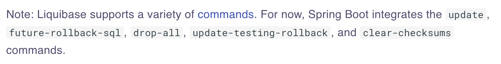

# Demo Springboot rollback data patch with liquibase
**Note: this demo only works for liquibase v4.20.0 and below.** this is because from Liquibase v4.21.0 and above, Liquibase has refactored the rollback API with different commandScope.
## Reason why I document this
- According Liquibase official document, Liquibase provides limited functionalities for Springboot integrates
[Using Liquibase with Spring Boot](https://contribute.liquibase.com/extensions-integrations/directory/integration-docs/springboot/springboot/)

- **Keep people away from data.** is becoming more and more important in our ecosystem. It is one of principle to keep our environment secure and stabled.
- In industry, sometime we may need **rollback** application if any issue detected in production. In the meanwhle we also need to rollback our **application data patch** made by the particular version.
- To manage **data patch rollback**, we have to make sure data consist with previously state after rollback. Liqiubase offers a very well data patching approach which allow us bundle the rollback scripts to each changeset.

# Getting Started
## Data roll forward
If you are managed to integrates springboot with liquibase, then each time springboot start up, it will auto apply db changesets via liquibase master file: resources/db/changelog/db.changelog-master.xml
### do remeber tag our database before each database changeset. 
liquibase db changeset to apply DB tag
```xml
<changeSet id="tagdb" author="dennyliang">
    <tagDatabase tag="v2.2.2"/>
</changeSet>
```
After adding database tag, each liquibase changeset must together with rollback tag except those auto rollback supported by Liquibase [Auto rollback tags](https://docs.liquibase.com/workflows/liquibase-community/automatic-custom-rollbacks.html). 
```xml
<rollback>
    <delete tableName="item">
        <where>
            house_id=(select id from house where owner='testowner2')
        </where>
    </delete>
    <delete tableName="house">
        <where>
            owner = 'testowner2'
        </where>
    </delete>
</rollback>
```

### to restrict Liquibase roll forward until which tag, we can configure below properties in springboot application.properties.
```properties
spring.liquibase.tag=v2.2.4
```

### configure rollback file is let springboot generate rollback file
```properties
spring.liquibase.rollbackFile=/Documents/Projects/spring-liquibase-demo/rollback.sql
```

## Full sample of liquibase changeset file

### Liquibase Changeset
```xml
<?xml version="1.0" encoding="UTF-8"?>
<databaseChangeLog
        xmlns="http://www.liquibase.org/xml/ns/dbchangelog"
        xmlns:xsi="http://www.w3.org/2001/XMLSchema-instance"
        xmlns:ext="http://www.liquibase.org/xml/ns/dbchangelog-ext"
        xmlns:pro="http://www.liquibase.org/xml/ns/pro"
        xsi:schemaLocation="http://www.liquibase.org/xml/ns/dbchangelog
http://www.liquibase.org/xml/ns/dbchangelog/dbchangelog-latest.xsd
http://www.liquibase.org/xml/ns/dbchangelog-ext http://www.liquibase.org/xml/ns/dbchangelog/dbchangelog-ext.xsd
http://www.liquibase.org/xml/ns/pro http://www.liquibase.org/xml/ns/pro/liquibase-pro-latest.xsd">
    <!--changeset tag-->
    <changeSet id="tagdb" author="dennyliang">
        <tagDatabase tag="v2.2.2"/>
    </changeSet>
    <changeSet id="202010211812" author="Julius Krah">
        <createTable tableName="house">
            <column name="id" type="bigint">
                <constraints primaryKey="true" primaryKeyName="house_id_pk" />
            </column>
            <column name="owner" type="varchar(250)">
                <constraints unique="true" uniqueConstraintName="house_owner_unq" />
            </column>
            <column name="fully_paid" type="boolean" defaultValueBoolean="false"/>
        </createTable>
        <createTable tableName="item">
            <column name="id" type="bigint">
                <constraints primaryKey="true" primaryKeyName="item_id_pk" />
            </column>
            <column name="name" type="varchar(250)" />
            <column name="house_id" type="bigint">
                <constraints nullable="false" notNullConstraintName="item_house_id_nn" />
            </column>
        </createTable>
        <addAutoIncrement tableName="house" columnName="id" columnDataType="bigint" startWith="1" incrementBy="1" />
        <addAutoIncrement tableName="item" columnName="id" columnDataType="bigint" startWith="1" incrementBy="1" />
        <createSequence sequenceName="hibernate_sequence" incrementBy="1" startValue="1" />
        <addForeignKeyConstraint baseTableName="item" baseColumnNames="house_id" constraintName="item_house_id_fk" referencedTableName="house" referencedColumnNames="id" />
        <!-- rollback script must be configure if enable db tag--> 
        <rollback>
            <dropForeignKeyConstraint baseTableName="item" constraintName="item_house_id_fk"/>
            <dropSequence sequenceName="hibernate_sequence"/>
            <dropTable tableName="item"/>
            <dropTable tableName="house"/>
        </rollback>
    </changeSet>
    <changeSet id="tagdb_v2.2.3" author="dennyliang">
        <tagDatabase tag="v2.2.3"/>
    </changeSet>
    <changeSet id="inset_record" author="dennyliang">
        <insert tableName="house">
            <column name="owner" value="testowner1"/>
            <column name="fully_paid" value="1"/>
        </insert>
        <insert tableName="item">
            <column name="name" value="testowner1"/>
            <column name="house_id" valueComputed="(select id from house where owner='testowner1')"/>
        </insert>
        <rollback>
            <delete tableName="item">
                <where>
                    house_id=(select id from house where owner='testowner1')
                </where>
            </delete>
            <delete tableName="house">
                <where>
                    owner = 'testowner1'
                </where>
            </delete>
        </rollback>
    </changeSet>
    <changeSet id="tagdb_v2.2.4" author="dennyliang">
        <tagDatabase tag="v2.2.4"/>
    </changeSet>
</databaseChangeLog>
```

### Implement Springboot API to rollback liquibase changes to particular tag
by rollback to tag v2.2.3, those insert into item, house records will be rolled back.
``` shell
curl -X GET "http://localhost:8080/rollbackLiquibaseByTag?tag=v2.2.3"
```

## Sample API which we trigger liquibase rollback via Springboot API
```java
@GetMapping("/rollbackLiquibaseByTag")
public String rollbackLiquibase(String tag){
    try {
        ResourceAccessor resourceAccessor = new SpringResourceAccessor(springLiquibase.getResourceLoader());
        DatabaseConnection connection = new JdbcConnection(springLiquibase.getDataSource().getConnection());
        Liquibase liquibase = new Liquibase(springLiquibase.getChangeLog(), resourceAccessor, connection);
        liquibase.rollback(tag, springLiquibase.getContexts());
        liquibase.close();
    } catch (SQLException | LiquibaseException e) {
        throw new RuntimeException(e);
    }
    return "Ok";
}
```